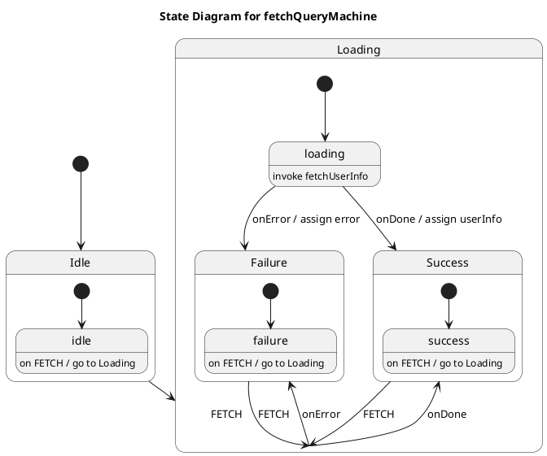

# client apis

Data query based on rtk query

```plantuml
@startuml
title State Diagram for fetchQueryMachine

[*] --> Idle

state Idle {
  [*] --> idle
  idle : on FETCH / go to Loading
}

state Loading {
  [*] --> loading
  loading : invoke fetchUserInfo
  loading --> Success : onDone / assign userInfo
  loading --> Failure : onError / assign error
}

state Success {
  [*] --> success
  success : on FETCH / go to Loading
}

state Failure {
  [*] --> failure
  failure : on FETCH / go to Loading
}

Idle --> Loading : FETCH
Loading --> Success : onDone
Loading --> Failure : onError
Success --> Loading : FETCH
Failure --> Loading : FETCH

@enduml

```
